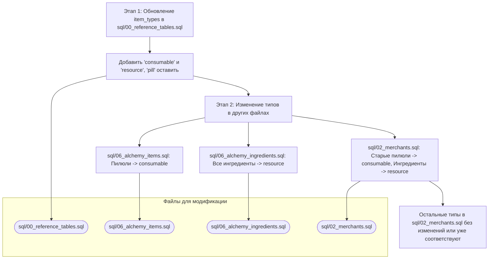

# Комплексный план обновления типов предметов в SQL-скриптах

## 1. Цель

Актуализировать типы предметов в SQL-скриптах согласно новой логике классификации для улучшения консистентности и соответствия игровой механике.

**Новая логика типизации:**
*   **`consumable`**: Все используемые предметы (пилюли, зелья).
*   **`resource`**: Те предметы, которые логически использовать (потребить напрямую для эффекта) нельзя, включая ингредиенты.
*   **Не трогаем**: Экипировку (оружие, броня, талисманы, аксессуары), артефакты, книги, корм для питомцев.

## 2. Этапы выполнения

### Этап 1: Обновление справочника `item_types`

**Файл:** `sql/00_reference_tables.sql`
**Задача:** Добавить новые типы `consumable` и `resource`. Тип `pill` остается.

**Изменения:**
В секцию `INSERT INTO item_types (id, name) VALUES` добавить:
```sql
('consumable', 'Расходуемые'),
('resource', 'Ресурсы')
```
Пример после добавления (порядок может отличаться):
```sql
INSERT INTO item_types (id, name) VALUES
('pill', 'Пилюли'),
('talisman', 'Талисманы'),
('weapon', 'Оружие'),
('armor', 'Броня'),
('accessory', 'Аксессуары'),
('consumable', 'Расходуемые'),
('resource', 'Ресурсы');
```

### Этап 2: Изменение типов предметов в основных определениях и у торговцев

#### 2.1. Файл `sql/06_alchemy_items.sql` (основные определения алхимических предметов)

*   **Пилюли** (6 предметов, строки 51-56):
    *   `qi_gathering_pill`, `body_strengthening_pill`, `meridian_clearing_pill`, `spirit_concentration_pill`, `core_formation_pill`, `soul_enlightenment_pill`.
    *   **Изменить** их текущий тип `pill` на **`consumable`**.
*   **Талисманы, Оружие, Броня, Аксессуары**:
    *   **Без изменений.**

#### 2.2. Файл `sql/06_alchemy_ingredients.sql` (определения ингредиентов)

*   **Все предметы** в этом файле (37 записей, строки 8-44).
    *   **Изменить** их текущий тип `ingredient` на **`resource`**.

#### 2.3. Файл `sql/02_merchants.sql` (товары у торговцев)

*   **`health_potion`** (строка 184):
    *   Текущий тип `consumable`. **Без изменений.**
*   **Новые пилюли (результаты алхимии) у Торговца Чена** (4 предмета, строки 256-259):
    *   `qi_gathering_pill`, `body_strengthening_pill`, `meridian_clearing_pill`, `spirit_concentration_pill`.
    *   Текущий тип `consumable`. **Без изменений.**
*   **Старые пилюли у Торговца Чена (которые затем удаляются скриптом)** (6 предметов, строки 189-194):
    *   `qi_gathering_pill`, `cleansing_pill`, `healing_pill`, `breakthrough_pill`, `mind_calming_pill`, `basic_cultivation_manual`.
    *   **Изменить** их текущий тип `pill` на **`consumable`**.
*   **Новые алхимические ингредиенты у Торговца Чена** (26 предметов, строки 209-234):
    *   **Изменить** их текущий тип `ingredient` на **`resource`**.
*   **Материалы для талисманов у Госпожи Юнь** (4 предмета, строки 238-241):
    *   **Изменить** их текущий тип `ingredient` на **`resource`**.
*   **Прочие алхимические ингредиенты у Торговца Чжао** (3 предмета, строки 245-247):
    *   **Изменить** их текущий тип `ingredient` на **`resource`**.
*   **Остальные предметы** (старые ресурсы, корм для питомцев, экипировка, книги, артефакты):
    *   **Без изменений.**

## 3. Диаграмма общего плана



## 4. Следующие шаги
1.  Записать этот план в Markdown-файл (`comprehensive_sql_type_update_plan.md`).
2.  Переключиться в режим "code" для последовательного внесения указанных изменений в файлы:
    *   Сначала в `sql/00_reference_tables.sql`.
    *   Затем в `sql/06_alchemy_items.sql`.
    *   Потом в `sql/06_alchemy_ingredients.sql`.
    *   И наконец, в `sql/02_merchants.sql`.