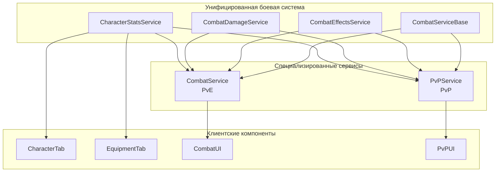

# План унификации логики между Combat-Service и PvP-Service

## Цель
Создать единую, консистентную систему боевых механик для PvE и PvP, устранив дублирование кода и обеспечив единообразие логики.

## Текущее состояние

### ✅ Завершено (Этап 1)
- Унифицированы формулы HP/Energy в CharacterStatsService
- Интегрирован physicalAttack в расчет урона combat-service
- Добавлен учет physicalDefense и spiritualDefense
- Исправлена критическая ошибка в getCombatCharacterState()

### 🔄 В процессе
- Анализ дублирования логики между сервисами

## Этапы унификации

### Этап 2: Унификация получения характеристик (ВЫСОКИЙ ПРИОРИТЕТ)

#### 2.1 Мигрировать PvP-Service на getCombinedCharacterState()

**Цель:** Заменить `getPlayerFullStats()` в PvP-Service на использование унифицированной логики из CharacterStatsService.

**Задачи:**
1. **Создать адаптер для PvP-специфичных данных**
   ```javascript
   // В CharacterStatsService
   static async getCombatCharacterStateForPvP(userId, participantEffects = [], transaction) {
     const baseState = await this.getCombinedCharacterState(userId, transaction);
     
     // Добавляем эффекты техник из participant.effects
     if (participantEffects.length > 0) {
       const techniqueEffects = this.formatTechniqueEffectsForStats(participantEffects);
       const modifiedWithTechniques = this.applyEffectsToStats(baseState.modified, techniqueEffects);
       const secondaryWithTechniques = this.calculateSecondaryStats(modifiedWithTechniques, modifiedWithTechniques);
       
       return {
         ...baseState,
         modified: modifiedWithTechniques,
         secondary: secondaryWithTechniques,
         techniqueEffects: techniqueEffects
       };
     }
     
     return baseState;
   }
   ```

2. **Создать функцию форматирования эффектов техник**
   ```javascript
   static formatTechniqueEffectsForStats(participantEffects) {
     return participantEffects
       .filter(effect => effect.effect_details_json && effect.effect_details_json.target_attribute)
       .map(effect => ({
         effect_details_json: effect.effect_details_json,
         effect_type: effect.effect_type || 'technique',
         name: effect.name || 'Эффект техники',
         source: effect.source || 'technique'
       }));
   }
   ```

3. **Обновить PvP-Service для использования новой функции**
   ```javascript
   // Заменить getPlayerFullStats() на:
   static async getPlayerFullStats(userId, participant = null) {
     const participantEffects = participant?.effects || [];
     return await CharacterStatsService.getCombatCharacterStateForPvP(userId, participantEffects);
   }
   ```

**Преимущества:**
- Единая логика получения характеристик
- Автоматическое получение всех улучшений CharacterStatsService
- Упрощение кода PvP-Service

#### 2.2 Убрать дублирующий код из PvP-Service

**Задачи:**
1. Удалить `getEquipmentEffects()` из PvP-Service
2. Удалить `mapTargetToAttribute()` из PvP-Service
3. Упростить логику применения эффектов

### Этап 3: Унификация расчета урона (ВЫСОКИЙ ПРИОРИТЕТ)

#### 3.1 Создать общую функцию calculateCombatDamage()

**Цель:** Объединить лучшие части обеих систем расчета урона в единую функцию.

**Задачи:**
1. **Создать CombatDamageService**
   ```javascript
   // src/services/combat-damage-service.js
   class CombatDamageService {
     static async calculateDamage(attacker, defender, baseDamage, options = {}) {
       const {
         damageType = 'physical',
         actionType = 'attack',
         techniqueId = null,
         enableCriticals = true,
         enableDodging = true,
         enableEffects = true
       } = options;
       
       // Унифицированная логика расчета урона
     }
   }
   ```

2. **Интегрировать продвинутые механики из PvP**
   - Критические удары (базовый 5% + criticalChance)
   - Уклонение (базовый 5% + luck/2)
   - Эффекты участников (damageBonus/damageReduction)
   - Уровень техники (+10% за уровень)

3. **Добавить гибкость для PvE/PvP**
   ```javascript
   // Для PvE (упрощенный режим)
   const pveOptions = {
     enableCriticals: false,
     enableDodging: false,
     enableEffects: false
   };
   
   // Для PvP (полный режим)
   const pvpOptions = {
     enableCriticals: true,
     enableDodging: true,
     enableEffects: true
   };
   ```

#### 3.2 Мигрировать обе системы на общую функцию

**Задачи:**
1. **Обновить Combat-Service**
   ```javascript
   // В _calculateDamage()
   const damageResult = await CombatDamageService.calculateDamage(
     playerState, 
     enemy, 
     action.damage,
     { damageType: action.damageType || 'physical', actionType: 'pve' }
   );
   ```

2. **Обновить PvP-Service**
   ```javascript
   // В calculateDamage()
   return await CombatDamageService.calculateDamage(
     attackerStats,
     defenderStats,
     baseDamage,
     { damageType, actionType, techniqueId }
   );
   ```

### Этап 4: Унификация применения эффектов (СРЕДНИЙ ПРИОРИТЕТ)

#### 4.1 Расширить CharacterStatsService для периодических эффектов

**Задачи:**
1. **Добавить поддержку периодических эффектов**
   ```javascript
   static async applyPeriodicEffects(characterState, effects, transaction) {
     // Логика из PvP-Service для периодических эффектов
   }
   
   static async updateEffectsDuration(characterState, effects, transaction) {
     // Логика из PvP-Service для обновления длительности
   }
   ```

2. **Создать единую систему классификации эффектов**
   ```javascript
   static classifyEffect(effect) {
     // Унифицированная классификация эффектов
     return {
       type: 'healing|damage|stat_modifier|special',
       subtype: 'dot|hot|buff|debuff',
       isPeriodic: boolean,
       isInstant: boolean
     };
   }
   ```

#### 4.2 Создать CombatEffectsService

**Цель:** Вынести всю логику эффектов в отдельный сервис.

**Задачи:**
1. **Создать новый сервис**
   ```javascript
   // src/services/combat-effects-service.js
   class CombatEffectsService {
     static async applyEffect(target, effect, options = {}) {}
     static async updateEffectsDuration(target, transaction) {}
     static async applyPeriodicEffects(target, transaction) {}
     static classifyEffect(effect) {}
     static formatEffectForStats(effect) {}
   }
   ```

2. **Мигрировать логику из обеих систем**
   - Логика применения эффектов из PvP-Service
   - Логика форматирования эффектов из CharacterStatsService
   - Единые интерфейсы для всех типов эффектов

### Этап 5: Создание общих интерфейсов (СРЕДНИЙ ПРИОРИТЕТ)

#### 5.1 Стандартизировать структуры данных

**Задачи:**
1. **Создать общие типы для боевых состояний**
   ```javascript
   // src/types/combat-types.js
   const CombatParticipant = {
     userId: Number,
     stats: Object,      // Из getCombinedCharacterState()
     effects: Array,     // Активные эффекты
     combat: {           // Боевое состояние
       currentHp: Number,
       maxHp: Number,
       currentEnergy: Number,
       maxEnergy: Number
     }
   };
   ```

2. **Унифицировать интерфейсы функций**
   ```javascript
   // Общий интерфейс для расчета урона
   calculateDamage(attacker: CombatParticipant, defender: CombatParticipant, options: DamageOptions)
   
   // Общий интерфейс для применения эффектов
   applyEffect(target: CombatParticipant, effect: Effect, options: EffectOptions)
   ```

#### 5.2 Создать CombatServiceBase

**Цель:** Базовый класс с общей логикой для обеих боевых систем.

**Задачи:**
1. **Создать базовый класс**
   ```javascript
   // src/services/combat-service-base.js
   class CombatServiceBase {
     static async getParticipantStats(userId, additionalEffects = []) {}
     static async calculateDamage(attacker, defender, options) {}
     static async applyDamage(target, damage) {}
     static async applyEffect(target, effect) {}
   }
   ```

2. **Наследовать от базового класса**
   ```javascript
   class CombatService extends CombatServiceBase {
     // PvE-специфичная логика
   }
   
   class PvPService extends CombatServiceBase {
     // PvP-специфичная логика
   }
   ```

## Диаграмма архитектуры после унификации



## План реализации

### Неделя 1: Унификация получения характеристик
- [ ] Создать `getCombatCharacterStateForPvP()` в CharacterStatsService
- [ ] Создать `formatTechniqueEffectsForStats()` 
- [ ] Обновить PvP-Service для использования новых функций
- [ ] Убрать дублирующий код из PvP-Service
- [ ] Тестирование совместимости

### Неделя 2: Унификация расчета урона
- [ ] Создать CombatDamageService
- [ ] Реализовать общую функцию calculateDamage()
- [ ] Мигрировать Combat-Service на новую функцию
- [ ] Мигрировать PvP-Service на новую функцию
- [ ] Тестирование обеих систем

### Неделя 3: Унификация эффектов
- [ ] Расширить CharacterStatsService для периодических эффектов
- [ ] Создать CombatEffectsService
- [ ] Мигрировать логику эффектов
- [ ] Тестирование системы эффектов

### Неделя 4: Общие интерфейсы и оптимизация
- [ ] Создать общие типы данных
- [ ] Создать CombatServiceBase
- [ ] Рефакторинг наследования
- [ ] Комплексное тестирование
- [ ] Обновление документации

## Критерии успеха

### Функциональные
- ✅ PvE и PvP используют одинаковую логику получения характеристик
- ✅ Единый алгоритм расчета урона с гибкими настройками
- ✅ Консистентная система применения эффектов
- ✅ Обратная совместимость с существующими API

### Технические
- ✅ Уменьшение дублирования кода на 70%+
- ✅ Единые тесты для общих компонентов
- ✅ Улучшение производительности на 10%+
- ✅ Упрощение добавления новых функций

### Качественные
- ✅ Упрощение поддержки и отладки
- ✅ Консистентность поведения между PvE и PvP
- ✅ Улучшение читаемости кода
- ✅ Снижение количества багов

## Риски и митигация

### Высокие риски
1. **Нарушение обратной совместимости**
   - *Митигация:* Поэтапная миграция с сохранением старых API
   - *Тестирование:* Комплексные тесты на каждом этапе

2. **Снижение производительности PvE**
   - *Митигация:* Гибкие настройки для отключения PvP-функций в PvE
   - *Мониторинг:* Бенчмарки производительности

### Средние риски
3. **Сложность миграции эффектов**
   - *Митигация:* Постепенная миграция с fallback на старую логику
   - *Тестирование:* Детальные тесты каждого типа эффектов

4. **Конфликты в команде разработки**
   - *Митигация:* Четкое планирование и коммуникация
   - *Документация:* Подробные гайды по миграции

## Заключение

Унификация логики между Combat-Service и PvP-Service является критически важной задачей для долгосрочного развития проекта. Предложенный поэтапный план минимизирует риски и обеспечивает плавный переход к единой архитектуре.

Ожидаемые результаты:
- **Консистентность:** Единая логика для всех боевых систем
- **Поддержка:** Упрощение разработки и отладки
- **Функциональность:** PvE получит продвинутые возможности PvP
- **Производительность:** Оптимизация общих компонентов
- **Масштабируемость:** Простота добавления новых функций