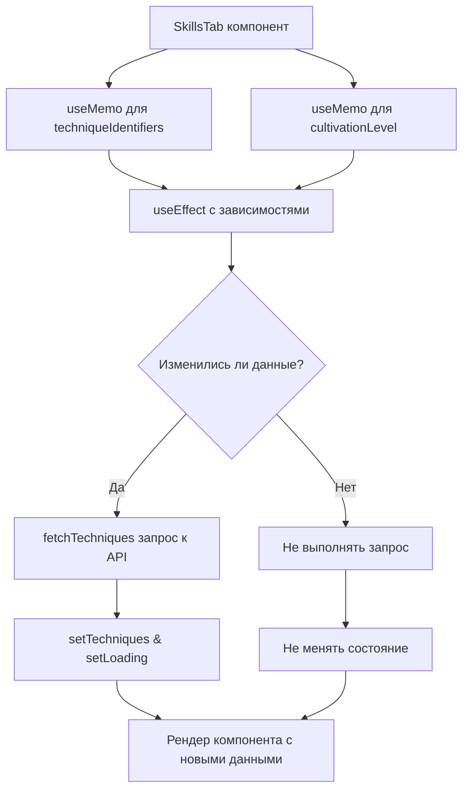

# Решение проблемы ежесекундных перезагрузок во вкладке техник

## Описание проблемы

В компоненте `SkillsTab` был обнаружен хук `useEffect`, который вызывает повторные перезагрузки из-за неправильных зависимостей:

```javascript
useEffect(() => {
  const fetchTechniques = async () => {
    // Код загрузки техник...
  };
  
  fetchTechniques();
}, [state.player?.techniques, state.player?.cultivation?.level]);
```

Проблема в том, что `state.player?.techniques` и `state.player?.cultivation?.level` - это вложенные объекты. В React зависимости в `useEffect` сравниваются только по ссылкам. Так как при любом обновлении состояния создаются новые ссылки на объекты, даже если их содержимое не изменилось, эффект вызывается при каждом обновлении состояния.

## План решения

### 1. Извлечь примитивные значения из объектов

Вместо вложенных объектов использовать примитивные значения, которые меняются только при реальном изменении данных:

```javascript
// Извлекаем необходимые примитивные значения
const learnedTechniquesIds = useMemo(() => {
  return state.player?.techniques?.map(t => t.id) || [];
}, [state.player?.techniques]);

const cultivationLevel = state.player?.cultivation?.level || 0;

useEffect(() => {
  // Код эффекта...
}, [JSON.stringify(learnedTechniquesIds), cultivationLevel]);
```

### 2. Мемоизация данных для стабильности ссылок

```javascript
// Мемоизация извлеченных значений
const techniqueData = useMemo(() => {
  return {
    techniqueIds: state.player?.techniques?.map(t => t.id) || [],
    cultivationLevel: state.player?.cultivation?.level || 0
  };
}, [
  state.player?.techniques?.length,  
  state.player?.techniques?.map(t => t.level).join(','),
  state.player?.cultivation?.level
]);

useEffect(() => {
  // Код эффекта...
}, [techniqueData]);
```

### 3. Использование useRef для отслеживания предыдущих значений

```javascript
const prevTechniqueIds = useRef([]);
const prevCultivationLevel = useRef(0);

useEffect(() => {
  // Получаем текущие значения
  const currentTechniqueIds = state.player?.techniques?.map(t => t.id) || [];
  const currentCultivationLevel = state.player?.cultivation?.level || 0;
  
  // Проверяем, изменились ли реально значения
  const techniquesChanged = JSON.stringify(prevTechniqueIds.current) !== JSON.stringify(currentTechniqueIds);
  const levelChanged = prevCultivationLevel.current !== currentCultivationLevel;
  
  if (techniquesChanged || levelChanged) {
    // Обновляем наши ref
    prevTechniqueIds.current = currentTechniqueIds;
    prevCultivationLevel.current = currentCultivationLevel;
    
    // Выполняем запрос только если действительно что-то изменилось
    fetchTechniques();
  }
}, [state.player]);
```

## Рекомендуемое решение

Оптимальным решением является использование комбинации `useMemo` и более специфических зависимостей:

```javascript
function SkillsTab() {
  const { state, actions } = useGame();
  const [selectedCategory, setSelectedCategory] = useState('все');
  const [selectedTechnique, setSelectedTechnique] = useState(null);
  const [techniques, setTechniques] = useState([]);
  const [loading, setLoading] = useState(true);
  
  // Извлекаем идентификаторы техник и их уровней
  const techniqueIdentifiers = useMemo(() => {
    if (!state.player?.techniques) return '';
    return state.player.techniques
      .map(t => `${t.id}:${t.level}`)
      .sort()
      .join(',');
  }, [state.player?.techniques]);
  
  // Получаем уровень культивации
  const cultivationLevel = useMemo(() => 
    state.player?.cultivation?.level || 0
  , [state.player?.cultivation?.level]);

  // Загружаем техники при загрузке компонента или изменении реальных данных
  useEffect(() => {
    const fetchTechniques = async () => {
      // Код загрузки техник...
    };
    
    fetchTechniques();
  }, [techniqueIdentifiers, cultivationLevel]); // Более стабильные зависимости
  
  // Остальной код компонента...
}
```

Этот подход гарантирует, что запрос к API будет происходить только тогда, когда реально изменились соответствующие данные (добавлены новые техники, изменились уровни техник или уровень культивации).

## Диаграмма решения



## Следующие шаги

1. Заменить зависимости в useEffect на более стабильные, используя useMemo
2. Использовать примитивные значения (числа, строки) или их строковые представления
3. Протестировать решение, проверив, что запросы к API происходят только при реальном изменении данных