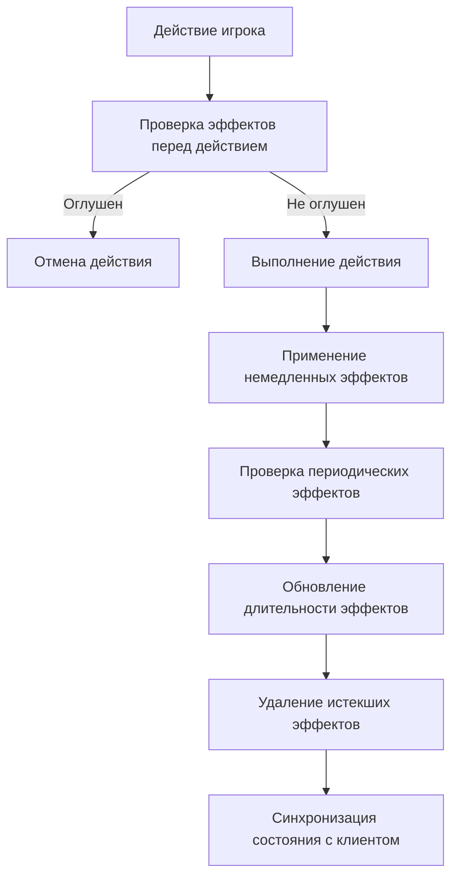

# План реализации системы эффектов в PvP

## 1. Типы эффектов и их механика

### 1.1. Регенерация (энергия/здоровье)
- **Механика**: Восстанавливает энергию или здоровье каждый ход
- **Параметры**: Количество восстанавливаемых единиц, длительность (в ходах)
- **Реализация**: Применять в начале хода участника

### 1.2. Урон от времени (burn/bleed)
- **Механика**: Наносит периодический урон цели
- **Параметры**: Количество урона за ход, длительность (в ходах)
- **Реализация**: Применять в начале хода участника

### 1.3. Ослабление (weaken)
- **Механика**: Снижает наносимый участником урон
- **Параметры**: Процент снижения урона, длительность (в ходах)
- **Реализация**: Учитывать при расчете урона в методе calculateDamage

### 1.4. Защита (protect)
- **Механика**: Снижает получаемый участником урон
- **Параметры**: Процент снижения урона, длительность (в ходах)
- **Реализация**: Уже частично реализовано, нужно расширить

### 1.5. Изменение скорости (speed)
- **Механика**: Уменьшает время перезарядки между действиями
- **Параметры**: Процент снижения времени перезарядки, длительность (в ходах)
- **Реализация**: Учитывать при проверке времени между действиями

### 1.6. Оглушение (stun)
- **Механика**: Блокирует возможность действий на один или несколько ходов
- **Параметры**: Длительность (в ходах)
- **Реализация**: Проверять наличие эффекта перед выполнением действия

## 2. Необходимые изменения в коде



### 2.1. Новые функции в PvPService

1. **updateEffectsDuration**
   - Уменьшает длительность всех эффектов у участника
   - Удаляет эффекты с истекшей длительностью
   - Обновляет статус участника, если он был оглушен

2. **applyPeriodicEffects**
   - Применяет эффекты регенерации и урона от времени
   - Обновляет здоровье и энергию участников
   - Создает записи в логе боя о примененных эффектах

3. **canPerformAction**
   - Проверяет наличие блокирующих эффектов (оглушение)
   - Возвращает статус возможности действия и причину блокировки

4. **getEffectModifiers**
   - Рассчитывает модификаторы от всех активных эффектов
   - Учитывает кумулятивный эффект от однотипных эффектов

### 2.2. Изменения в существующих функциях

1. **calculateDamage**
   - Добавить учет эффекта ослабления у атакующего
   - Дополнить учет эффекта защиты у цели
   - Добавить логирование модификаторов для отладки

2. **performAction**
   - Добавить проверку возможности действия через canPerformAction
   - Вызывать updateEffectsDuration после каждого действия
   - Добавить логику применения периодических эффектов

3. **getRoomState**
   - Добавить расчет и передачу клиенту информации о модификаторах от эффектов
   - Обеспечить правильное отображение оставшейся длительности эффектов

## 3. План реализации по шагам

### Шаг 1: Структура данных для эффектов
1. Стандартизировать формат эффектов во всей системе
2. Добавить метаданные для всех типов эффектов (иконки, описания)

### Шаг 2: Функции управления эффектами
1. Реализовать updateEffectsDuration для управления длительностью
2. Реализовать applyPeriodicEffects для периодических эффектов
3. Реализовать canPerformAction для проверки возможности действия

### Шаг 3: Интеграция в поток боя
1. Обновить метод performAction для проверки и применения эффектов
2. Добавить учет эффектов в calculateDamage
3. Синхронизировать данные с клиентом через getRoomState

### Шаг 4: Визуальное отображение
1. Улучшить отображение эффектов в компоненте BattleEffects
2. Добавить анимации для применения эффектов
3. Реализовать подсказки для отображения влияния эффектов

### Шаг 5: Тестирование и балансировка
1. Тестирование всех типов эффектов
2. Настройка параметров для баланса
3. Исправление обнаруженных ошибок

## 4. Приоритетность реализации

1. **Высокий приоритет**:
   - Обновление длительности эффектов
   - Удаление истекших эффектов
   - Базовое применение всех типов эффектов

2. **Средний приоритет**:
   - Улучшенное визуальное отображение
   - Кумулятивные эффекты от однотипных источников
   - Детальная информация о модификаторах

3. **Низкий приоритет**:
   - Анимации применения эффектов
   - Дополнительные типы эффектов
   - Балансировка значений

## 5. Технические детали реализации

### 5.1. Формат эффекта в базе данных
```javascript
{
  id: 'effect_id',
  name: 'Название эффекта',
  icon: '🔥', // Иконка для отображения
  type: 'buff/debuff', // Тип эффекта
  subtype: 'regenerate/burn/weaken/protect/speed/stun', // Подтип для определения механики
  duration: 3, // Длительность в ходах
  elapsedTurns: 0, // Прошедшие ходы
  value: 10, // Значение эффекта (урон, лечение, процент)
  appliedAt: '2025-05-30T12:34:56.789Z' // Время применения
}
```

### 5.2. Алгоритм применения эффектов
```
1. При каждом действии игрока:
   a. Проверить наличие эффекта оглушения
   b. Если игрок оглушен, отменить действие и вернуть ошибку
   c. Выполнить действие (атака, защита, техника)
   d. Применить новые эффекты от действия
   e. Проверить и применить периодические эффекты
   f. Обновить длительность всех эффектов
   g. Удалить истекшие эффекты
   h. Обновить статус участников (проверка поражения)
   i. Отправить обновленные данные клиенту
```

## 6. Детализация реализации особых типов эффектов

### 6.1. Эффекты, основанные на реальном времени

В текущей системе необходимо поддерживать два типа эффектов:
1. **Эффекты, основанные на ходах** - длительность измеряется в количестве ходов
2. **Эффекты, основанные на реальном времени** - длительность измеряется в миллисекундах

#### Структура эффекта, основанного на реальном времени:
```javascript
{
  id: 'speed_boost',
  name: 'Ускорение',
  icon: '⚡',
  type: 'buff',
  subtype: 'speed',
  // Вместо "duration" в ходах используем "durationMs" в миллисекундах
  durationMs: 30000, // 30 секунд
  startTime: 1622308800000, // Timestamp начала действия эффекта
  value: 30, // Процент ускорения (снижения времени ожидания)
}
```

#### Функции для работы с временными эффектами:
```javascript
// Проверка и удаление истекших временных эффектов
function removeExpiredTimeEffects(participant) {
  const now = Date.now();
  if (!participant.effects) return [];
  
  const timeBasedEffects = participant.effects.filter(e => e.durationMs);
  const expiredEffects = [];
  
  participant.effects = participant.effects.filter(effect => {
    if (!effect.durationMs) return true; // Оставляем эффекты на основе ходов
    
    const isExpired = (now - effect.startTime) >= effect.durationMs;
    if (isExpired) expiredEffects.push(effect);
    return !isExpired;
  });
  
  return expiredEffects;
}

// Вычисление оставшегося времени эффекта
function getRemainingEffectTime(effect) {
  const now = Date.now();
  const elapsedMs = now - effect.startTime;
  return Math.max(0, effect.durationMs - elapsedMs);
}
```

### 6.2. Реализация изменения скорости (уменьшение интервала между ходами)

#### Серверная часть:
```javascript
// Расчет индивидуального времени перезарядки для участника
function calculateActionCooldown(participant) {
  // Базовый интервал между действиями - 5 секунд
  let baseCooldown = 5000; // ms
  
  // Если у участника есть эффекты скорости, применяем их
  if (participant.effects && participant.effects.length > 0) {
    const speedEffects = participant.effects.filter(e => e.subtype === 'speed');
    
    for (const effect of speedEffects) {
      // Уменьшаем время кулдауна на указанный процент
      baseCooldown *= (1 - (effect.value / 100));
    }
  }
  
  // Минимальный интервал - 1 секунда
  return Math.max(1000, Math.floor(baseCooldown));
}

// Проверка возможности действия с учетом скорости
function canPerformActionWithSpeed(participant) {
  if (!participant.last_action_time) return true;
  
  const now = new Date();
  const lastActionTime = new Date(participant.last_action_time);
  const cooldown = calculateActionCooldown(participant);
  const timeDiffMs = now - lastActionTime;
  
  return timeDiffMs >= cooldown;
}
```

#### Клиентская часть:
Для правильной работы скорости на клиенте необходимо:

1. Добавить расчет индивидуального кулдауна для каждого участника в методе `getRoomState`:
```javascript
// В методе getRoomState класса PvPService
for (const participant of participants) {
  // Добавляем рассчитанный кулдаун для каждого игрока
  participant.action_cooldown = this.calculateActionCooldown(participant);
  
  // Добавляем оставшееся время до следующего действия
  if (participant.last_action_time) {
    const now = new Date();
    const lastAction = new Date(participant.last_action_time);
    const elapsedMs = now - lastAction;
    participant.cooldown_remaining_ms = Math.max(0, participant.action_cooldown - elapsedMs);
  } else {
    participant.cooldown_remaining_ms = 0;
  }
}
```

2. Модифицировать компонент `BattleInterface.js` для работы с динамическим интервалом:
```javascript
// Для отображения правильного времени кулдауна
useEffect(() => {
  if (!canActRef.current && currentParticipant) {
    const interval = setInterval(() => {
      const now = new Date();
      const lastAction = new Date(currentParticipant.last_action_time);
      const cooldown = currentParticipant.action_cooldown || 5000; // Получаем от сервера
      const elapsedMs = now - lastAction;
      const remainingMs = Math.max(0, cooldown - elapsedMs);
      
      setRemainingCooldown(Math.ceil(remainingMs / 1000));
      
      if (remainingMs <= 0) {
        canActRef.current = true;
        forceUpdate({});
        clearInterval(interval);
      }
    }, 100);
    
    return () => clearInterval(interval);
  }
}, [currentParticipant?.last_action_time, currentParticipant?.action_cooldown]);
```

### 6.3. Обработка периодических эффектов

#### Функции для различных типов эффектов:

```javascript
// Применение регенерации энергии/здоровья
function applyRegenerationEffect(participant, effect) {
  if (effect.subtype === 'health_regen') {
    const healingAmount = effect.value;
    participant.current_hp = Math.min(
      participant.max_hp, 
      participant.current_hp + healingAmount
    );
    return {
      type: 'heal',
      amount: healingAmount,
      message: `${participant.username} восстановил ${healingAmount} здоровья от ${effect.name}`
    };
  } else if (effect.subtype === 'energy_regen') {
    const energyAmount = effect.value;
    participant.current_energy = Math.min(
      participant.max_energy, 
      participant.current_energy + energyAmount
    );
    return {
      type: 'energy',
      amount: energyAmount,
      message: `${participant.username} восстановил ${energyAmount} энергии от ${effect.name}`
    };
  }
  return null;
}

// Применение периодического урона
function applyDamageOverTimeEffect(participant, effect) {
  const damageAmount = effect.value;
  participant.current_hp = Math.max(0, participant.current_hp - damageAmount);
  const newStatus = participant.current_hp <= 0 ? 'defeated' : 'active';
  const wasDefeated = participant.status !== 'defeated' && newStatus === 'defeated';
  participant.status = newStatus;
  
  return {
    type: 'damage_over_time',
    amount: damageAmount,
    defeated: wasDefeated,
    message: `${participant.username} получил ${damageAmount} урона от ${effect.name}`
  };
}

// Проверка состояния оглушения
function isStunned(participant) {
  return participant.effects && 
         participant.effects.some(e => e.subtype === 'stun' && e.duration > e.elapsedTurns);
}
```

### 6.4. Интеграция всех типов эффектов

Обобщенный алгоритм интеграции всех типов эффектов в ход боя:

1. **Перед каждым действием**:
   - Проверить и удалить истекшие эффекты, основанные на реальном времени
   - Проверить наличие эффекта оглушения
   - Рассчитать индивидуальный кулдаун с учетом эффектов скорости

2. **После каждого действия**:
   - Применить новые эффекты от техники или действия
   - Применить периодические эффекты (регенерация, урон от времени)
   - Обновить длительность эффектов, основанных на ходах
   - Проверить условия окончания боя (поражение участников)

3. **Для каждого запроса состояния комнаты**:
   - Обновить оставшееся время для эффектов, основанных на реальном времени
   - Рассчитать и передать клиенту актуальные модификаторы от эффектов
   - Передать информацию о состоянии всех эффектов (длительность, сила)

### 6.5. Визуальные аспекты эффектов

Для улучшения пользовательского опыта необходимо реализовать:

1. **Индикаторы эффектов**:
   - Иконки для разных типов эффектов
   - Отображение оставшегося времени/ходов
   - Индикация силы эффекта (слабый/средний/сильный)

2. **Цветовая кодировка**:
   - Баффы - зеленый цвет
   - Дебаффы - красный цвет
   - Нейтральные эффекты - синий цвет

3. **Анимации**:
   - Анимация применения эффекта
   - Анимация периодического действия (пульсация для DoT)
   - Анимация истечения эффекта