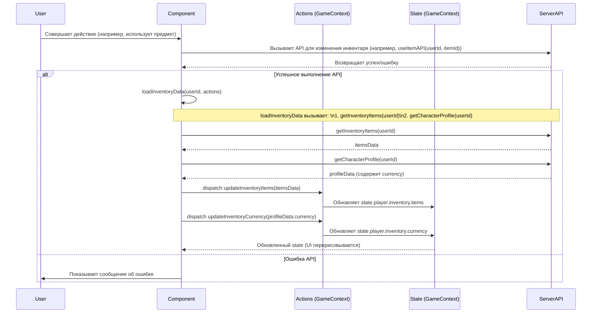

# План рефакторинга логики инвентаря

## 1. Обзор

Цель этого рефакторинга - изменить способ получения и обновления данных инвентаря в клиентских компонентах. Вместо прямого чтения и модификации локального состояния `state.player.inventory`, компоненты будут получать данные инвентаря (`items` и `currency`) с сервера через API-вызовы. Локальное состояние `state.player.inventory` в глобальном контексте игры (`GameContext`) будет сохранено, но будет служить только для чтения и будет обновляться исключительно данными, полученными с сервера.

## 2. Ключевые Принципы

*   **`userId`**: Для всех API-запросов, связанных с инвентарем, будет использоваться `state.player.id`.
*   **Глобальное состояние `state.player.inventory`**:
    *   Остается в `GameContext`.
    *   Содержит `items` и `currency`.
    *   Обновляется **только** данными, полученными с сервера.
    *   Для обновления будут созданы новые `actions` в `GameContext` (например, `updateInventoryItems(items)` и `updateInventoryCurrency(currency)`).
*   **Загрузка данных**:
    *   Будет использоваться централизованная асинхронная функция (например, `loadInventoryData(userId, actions)`).
    *   Эта функция будет:
        1.  Запрашивать предметы: `await getInventoryItems(userId);` (из `services/inventory-api.js`).
        2.  Запрашивать профиль (для валюты): `await getCharacterProfile(userId);` (из `services/character-profile-service-api.js`).
        3.  Диспатчить `actions` для обновления `state.player.inventory.items` и `state.player.inventory.currency` в глобальном состоянии.
    *   `loadInventoryData` будет вызываться при инициализации компонентов, которым нужен инвентарь, и после каждой серверной операции, изменяющей инвентарь.
*   **Изменение инвентаря**:
    *   Любые действия, которые ранее изменяли инвентарь на клиенте (использование/удаление предметов, трата валюты, получение наград и т.д.), теперь будут:
        1.  Вызывать соответствующий API-метод на сервере, который произведет фактические изменения данных.
        2.  После успешного ответа от сервера, клиент вызовет `loadInventoryData(userId, actions)` для перезагрузки актуальных данных инвентаря с сервера и обновления глобального состояния.
    *   Прямые модификации `state.player.inventory` на клиенте (кроме обновления с сервера) будут устранены.
*   **Удаление `equipment`**: Поле `equipment` из `state.player.inventory` полностью удаляется. Компоненты, отображающие экипировку, будут работать с полем `equipped: true` у отдельных предметов в `state.player.inventory.items`.

## 3. План по Компонентам

### Общие шаги для всех затронутых компонентов:
*   **Импорты**:
    *   `import { getInventoryItems } from '../../services/inventory-api';`
    *   `import { getCharacterProfile } from '../../services/character-profile-service-api';`
    *   Убедиться в наличии `useGame` из `../../context/GameContext`.
*   **Получение `userId`**: Использовать `state.player.id`.
*   **Использование `loadInventoryData`**: Вызывать эту функцию для инициализации и обновления данных инвентаря.

### Конкретные компоненты:

1.  **[`src/components/debug/DebugTools.js`](src/components/debug/DebugTools.js)**
    *   Функция `addCurrency`:
        *   Импортировать и использовать `updateCurrency(userId, currencyData)` из `character-profile-service-api.js`.
        *   Перед вызовом `updateCurrency`, получить текущую валюту через `getCharacterProfile(userId)`.
        *   После успешного вызова `updateCurrency`, вызвать `loadInventoryData` для обновления глобального состояния.
        *   Удалить прямой вызов `gameContext.actions.updateCurrency()`.

2.  **[`src/components/pages/GamePage.js`](src/components/pages/GamePage.js)**
    *   Отображение валюты (например, золота) будет использовать `state.player.inventory.currency`, которое обновляется централизованно.
    *   Зависимость `useEffect` для автосохранения от `state.player.inventory` остается актуальной. `saveGameState(state, ...)` продолжит работать корректно, так как `state.player.inventory` будет содержать актуальные данные.

3.  **[`src/components/tabs/CultivationTab.js`](src/components/tabs/CultivationTab.js)**
    *   Использовать `state.player.inventory.items` для проверки ресурсов.
    *   При необходимости (например, при инициализации), вызывать `loadInventoryData`.
    *   Удалить `actions.removeItem`. Предполагается, что серверный API для прорыва (`CultivationAdapter.performBreakthrough`) сам списывает ресурсы.
    *   После успешного прорыва вызывать `loadInventoryData`.

4.  **[`src/components/tabs/EquipmentTab.js`](src/components/tabs/EquipmentTab.js)**
    *   Использовать `state.player.inventory.items` для отображения и управления экипировкой.
    *   При инициализации вызывать `loadInventoryData`.
    *   Действия по экипировке/снятию предметов должны вызывать API на сервере, после чего вызывать `loadInventoryData`.
    *   Логика обогащения предметов: если изменяет предмет на сервере, то после успеха вызывать `loadInventoryData`.

5.  **[`src/components/tabs/InventoryTab.js`](src/components/tabs/InventoryTab.js)**
    *   Модифицировать существующую функцию `fetchAndEnrichInventory` (или переименовать в `loadInventoryData` и адаптировать):
        *   После получения и обогащения `items`, диспатчить `action` для обновления `state.player.inventory.items`.
        *   Добавить вызов `getCharacterProfile(userId)` для получения `currency`.
        *   Диспатчить `action` для обновления `state.player.inventory.currency`.
    *   Использовать `state.player.inventory.items` и `state.player.inventory.currency` для отображения.
    *   Функции `handleEquipItem` и `handleConsumeItem` уже вызывают API и затем `fetchAndEnrichInventory()`. Это поведение сохраняется, `fetchAndEnrichInventory` теперь будет обновлять глобальное состояние.

6.  **[`src/components/tabs/SkillsTab.js`](src/components/tabs/SkillsTab.js)**
    *   Использовать `state.player.inventory.currency` для проверки стоимости.
    *   При инициализации вызывать `loadInventoryData`.
    *   Серверный API для изучения/улучшения техник (`techniqueAdapter.learnTechnique`, `techniqueAdapter.upgradeTechnique`) должен сам списывать валюту.
    *   После успешного изучения/улучшения техники вызывать `loadInventoryData`.

## 4. Новые Actions для GameContext (Примерные)

*   `updateInventoryItems(items)`: Принимает массив предметов и обновляет `state.player.inventory.items`.
*   `updateInventoryCurrency(currency)`: Принимает объект валют и обновляет `state.player.inventory.currency`.

## 5. Общий Поток Данных (Mermaid Диаграмма)

## 6. Следующие Шаги

После утверждения этого плана можно переходить к реализации изменений в коде.