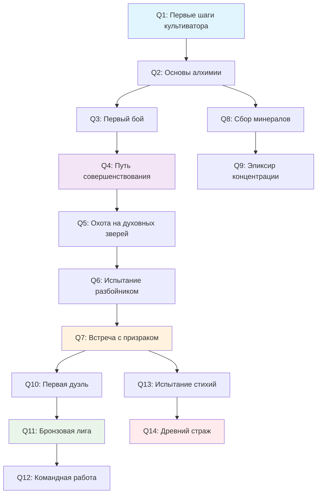

# Финальный план системы квестов

## Обзор

Этот документ содержит исправленный план системы квестов, который полностью соответствует существующей игровой механике культивации и использует реальные данные из базы данных.

## Анализ существующих данных

### Враги (из `sql/03_enemies.sql`)

| ID | Название | Уровень | Категория | Описание |
|----|----------|---------|-----------|----------|
| `training_dummy` | Тренировочный манекен | 1 | construct | Простой деревянный манекен для тренировки |
| `weak_spirit_beast` | Слабый духовный зверь | 3 | spirit_beast | Молодой духовный зверь |
| `mountain_bandit` | Горный разбойник | 5 | bandit | Бандит с базовыми боевыми техниками |
| `water_elemental` | Водный элементаль | 6 | water_elemental | Существо из живой воды |
| `night_wraith` | Ночной призрак | 7 | undead | Мстительный дух ночи |
| `lightning_spirit` | Дух молнии | 8 | lightning_elemental | Элементальное существо грозы |
| `ancient_guardian` | Древний страж | 10 | elemental | Духовная сущность древних руин |

### PvP режимы (из `sql/40_pvp_system.sql`)

| Режим | Описание | Игроки | Награды |
|-------|----------|--------|---------|
| Дуэль 1v1 | Классический поединок | 2 | 100 золота за победу |
| Командный бой 3v3 | Командное сражение | 6 | 150 золота за победу |
| Битва сект 5v5 | Масштабное сражение | 10 | 200 золота за победу |
| Турнир мастеров | Для высокоуровневых культиваторов | 2 | 300 золота за победу |

### Алхимические ингредиенты (из `sql/06_alchemy_ingredients.sql`)

| ID | Название | Редкость | Цена | Описание |
|----|----------|----------|------|----------|
| `herb_qigathering` | Трава сбора ци | common | 20 | Базовая трава для сбора ци |
| `herb_ironroot` | Железный корень | common | 30 | Прочный корень растения |
| `herb_clearflow` | Кристальный цветок | uncommon | 50 | Прозрачный цветок у источников |
| `mineral_dust` | Минеральная пыль | common | 10 | Смесь измельченных минералов |
| `water_spirit` | Духовная вода | common | 15 | Вода с природной энергией |
| `essence_concentration` | Эссенция концентрации | rare | 120 | Усиливает ментальную фокусировку |

## Типы целей квестов

### Существующие типы
- `GATHER_ITEM` - Собрать определенное количество предметов
- `DEFEAT_ENEMY` - Победить определенных врагов
- `CRAFT_ITEM` - Создать алхимические предметы
- `REACH_LEVEL` - Достичь уровня культивации

### Новые типы
- `PVP_WIN` - Выиграть PvP бои определенного типа
- `PVP_RATING` - Достичь определенного рейтинга в PvP

## Структура квестов

### Начальные квесты (уровень 1-5)

#### Q1: Первые шаги культиватора
- **Тип**: `GATHER_ITEM`
- **Цель**: Собрать 5 трав сбора ци (`herb_qigathering`)
- **Описание**: "Соберите базовые травы для начала пути культивации"
- **Награда**: 50 опыта, 100 золота
- **Требования**: Нет

#### Q2: Основы алхимии
- **Тип**: `CRAFT_ITEM`
- **Цель**: Создать 1 базовое зелье (`basic_potion`)
- **Описание**: "Изучите основы алхимии, создав первое зелье"
- **Награда**: 75 опыта, 150 золота
- **Требования**: Завершить Q1

#### Q3: Первый бой
- **Тип**: `DEFEAT_ENEMY`
- **Цель**: Победить 1 тренировочный манекен (`training_dummy`)
- **Описание**: "Проверьте свои боевые навыки на тренировочном манекене"
- **Награда**: 100 опыта, 200 золота
- **Требования**: Завершить Q2

#### Q4: Путь совершенствования
- **Тип**: `REACH_LEVEL`
- **Цель**: Достичь 5 уровня культивации
- **Описание**: "Продолжите культивацию до 5 уровня"
- **Награда**: 200 опыта, 500 золота, базовое руководство по культивации
- **Требования**: Завершить Q3

### Боевые квесты (уровень 5-10)

#### Q5: Охота на духовных зверей
- **Тип**: `DEFEAT_ENEMY`
- **Цель**: Победить 3 слабых духовных зверей (`weak_spirit_beast`)
- **Описание**: "Испытайте себя в бою с духовными зверями"
- **Награда**: 150 опыта, 300 золота, эссенция зверя
- **Требования**: Завершить Q4

#### Q6: Испытание разбойником
- **Тип**: `DEFEAT_ENEMY`
- **Цель**: Победить 1 горного разбойника (`mountain_bandit`)
- **Описание**: "Сразитесь с опасным горным разбойником"
- **Награда**: 200 опыта, 400 золота, железный меч (шанс)
- **Требования**: Завершить Q5

#### Q7: Встреча с призраком
- **Тип**: `DEFEAT_ENEMY`
- **Цель**: Победить 1 ночного призрака (`night_wraith`)
- **Описание**: "Сразитесь с мстительным духом ночи"
- **Награда**: 250 опыта, 500 золота, ночная жемчужина (шанс)
- **Требования**: Завершить Q6

### Алхимические квесты (уровень 3-8)

#### Q8: Сбор минералов
- **Тип**: `GATHER_ITEM`
- **Цель**: Собрать 10 минеральной пыли (`mineral_dust`)
- **Описание**: "Соберите минералы для продвинутой алхимии"
- **Награда**: 100 опыта, 200 золота
- **Требования**: Завершить Q2

#### Q9: Эликсир концентрации
- **Тип**: `CRAFT_ITEM`
- **Цель**: Создать 1 эликсир концентрации (`concentration_potion`)
- **Описание**: "Создайте мощный эликсир для усиления разума"
- **Награда**: 300 опыта, 600 золота, рецепт продвинутых зелий
- **Требования**: Завершить Q8

### PvP квесты (уровень 8+)

#### Q10: Первая дуэль
- **Тип**: `PVP_WIN`
- **Цель**: Выиграть 1 дуэль 1v1 (`duel_1v1`)
- **Описание**: "Докажите свое мастерство в честной дуэли"
- **Награда**: 400 опыта, 800 золота, медаль дуэлянта
- **Требования**: Завершить Q7, уровень 8+

#### Q11: Бронзовая лига
- **Тип**: `PVP_RATING`
- **Цель**: Достичь рейтинга 1000 (бронзовая лига)
- **Описание**: "Поднимитесь до бронзовой лиги в PvP арене"
- **Награда**: 500 опыта, 1000 золота, медаль бронзовой лиги
- **Требования**: Завершить Q10

#### Q12: Командная работа
- **Тип**: `PVP_WIN`
- **Цель**: Выиграть 1 командный бой 3v3 (`team_3v3`)
- **Описание**: "Сражайтесь в команде и одержите победу"
- **Награда**: 600 опыта, 1200 золота, амулет командной работы
- **Требования**: Завершить Q11

### Продвинутые квесты (уровень 10+)

#### Q13: Испытание стихий
- **Тип**: `DEFEAT_ENEMY`
- **Цель**: Победить 1 водного элементаля (`water_elemental`) и 1 духа молнии (`lightning_spirit`)
- **Описание**: "Сразитесь с силами природы"
- **Награда**: 800 опыта, 1500 золота, кристалл стихий
- **Требования**: Завершить Q7, уровень 10+

#### Q14: Древний страж
- **Тип**: `DEFEAT_ENEMY`
- **Цель**: Победить 1 древнего стража (`ancient_guardian`)
- **Описание**: "Сразитесь с могущественным стражем древних руин"
- **Награда**: 1000 опыта, 2000 золота, древняя реликвия (шанс)
- **Требования**: Завершить Q13

## Схема прогрессии квестов



## Интеграция с сервисами

### 1. Combat Service (`src/services/combat-service.js`)

**Точка интеграции**: Метод `_processRewards` (строка ~688)

```javascript
// Добавить после обработки наград
await QuestService.checkQuestEvent(userId, 'DEFEAT_ENEMY', combat.enemy_id);
```

### 2. PvP Service (`src/services/pvp-service.js`)

**Точка интеграции**: Метод `updateBattleHistoryAndRatings` (строка ~3733)

```javascript
// Добавить после обновления рейтинга для победителей
if (result === 'win') {
    await QuestService.checkQuestEvent(userId, 'PVP_WIN', room.mode.name);
    await QuestService.checkQuestEvent(userId, 'PVP_RATING', newRating);
}
```

### 3. Alchemy Service (`src/services/alchemy-service.js`)

**Точка интеграции**: Метод создания предметов

```javascript
// Добавить после успешного создания предмета
await QuestService.checkQuestEvent(userId, 'CRAFT_ITEM', itemId);
```

### 4. Cultivation Service (`src/services/cultivation-service.js`)

**Точка интеграции**: Метод повышения уровня

```javascript
// Добавить после повышения уровня
await QuestService.checkQuestEvent(userId, 'REACH_LEVEL', newLevel);
```

### 5. Inventory Service (`src/services/inventory-service.js`)

**Точка интеграции**: Метод добавления предметов

```javascript
// Добавить после добавления предмета в инвентарь
await QuestService.checkQuestEvent(userId, 'GATHER_ITEM', itemId);
```

## Обновления базы данных

### Новые записи в таблице `quests`

```sql
-- Обновление существующих квестов с правильными данными
UPDATE quests SET 
    name = 'Первые шаги культиватора',
    description = 'Соберите базовые травы для начала пути культивации',
    objectives = '[{"id": 1, "description": "Собрать травы сбора ци", "type": "GATHER_ITEM", "target": "herb_qigathering", "required": 5, "current": 0}]'
WHERE id = 'q1';

UPDATE quests SET 
    name = 'Основы алхимии',
    description = 'Изучите основы алхимии, создав первое зелье',
    objectives = '[{"id": 1, "description": "Создать базовое зелье", "type": "CRAFT_ITEM", "target": "basic_potion", "required": 1, "current": 0}]'
WHERE id = 'q2';

-- И так далее для всех квестов...
```

### Новые типы целей в `quest_objectives`

```sql
-- Добавить новые типы, если их нет
INSERT INTO quest_objectives (quest_id, description, type, target, required, current) VALUES
('q10', 'Выиграть дуэль 1v1', 'PVP_WIN', 'duel_1v1', 1, 0),
('q11', 'Достичь бронзовой лиги', 'PVP_RATING', 'bronze_league', 1000, 0);
```

## Метод `checkQuestEvent` в QuestService

```javascript
static async checkQuestEvent(userId, eventType, eventTarget, eventValue = 1) {
    try {
        // Получаем активные квесты пользователя
        const activeQuests = await this.getActiveQuests(userId);
        
        for (const quest of activeQuests) {
            for (const objective of quest.objectives) {
                // Проверяем соответствие типа и цели
                if (objective.type === eventType && objective.target === eventTarget) {
                    // Обновляем прогресс
                    objective.current = Math.min(
                        objective.current + eventValue, 
                        objective.required
                    );
                    
                    // Сохраняем обновленный прогресс
                    await this.updateQuestProgress(userId, quest.id, objective.id, objective.current);
                    
                    // Проверяем завершение квеста
                    if (this.isQuestCompleted(quest)) {
                        await this.completeQuest(userId, quest.id);
                    }
                }
            }
        }
    } catch (error) {
        console.error('[QuestService] Ошибка при проверке события квеста:', error);
    }
}
```

## Заключение

Этот план обеспечивает:

1. **Соответствие игровой тематике**: Все квесты связаны с культивацией и используют реальных врагов
2. **Автоматическое отслеживание**: Интеграция с существующими сервисами
3. **Прогрессивность**: Логичная последовательность от простых к сложным квестам
4. **Разнообразие**: Боевые, алхимические и PvP квесты
5. **Реальные данные**: Использование существующих ID врагов, предметов и механик

Система готова к реализации и полностью совместима с существующей архитектурой игры.