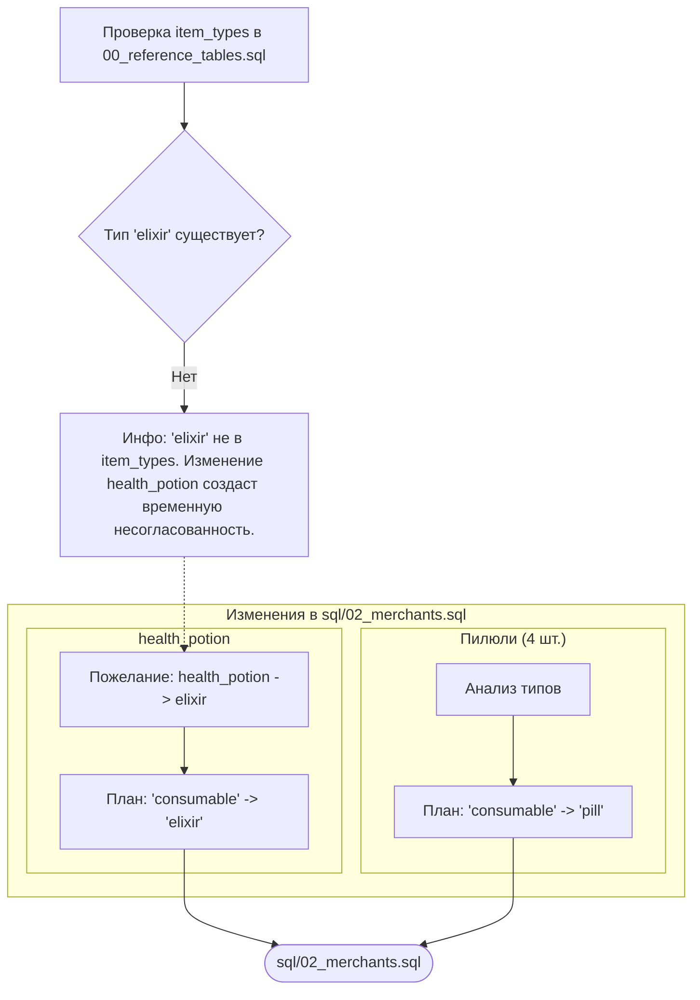

# План изменения типов предметов в SQL-скриптах

## 1. Цель

Актуализировать типы некоторых предметов в файле `sql/02_merchants.sql` для лучшего соответствия логике игры и основным определениям предметов.

## 2. Анализ и выводы

*   **Проверка `recipe_ingredients`**: Предметы типа `pill` (пилюли) не используются в качестве ингредиентов в таблице `recipe_ingredients`. Используемые там предметы имеют тип `ingredient`.
*   **Тип `elixir`**: В справочной таблице `item_types` (файл `sql/00_reference_tables.sql`) тип `elixir` в настоящее время отсутствует. Изменение типа `health_potion` на `elixir` будет произведено с пониманием, что это создаст временную несогласованность до момента добавления типа `elixir` в `item_types`.
*   **Тип `pill`**: Тип `pill` существует в `item_types`, что делает изменение типов для пилюль согласованным.

## 3. Предлагаемые изменения

Все изменения касаются файла `sql/02_merchants.sql` в таблице `merchant_inventory_templates`.

### 3.1. Изменение типа для `health_potion`

*   **Предмет**: `health_potion`
*   **Текущая строка (приблизительно 184):**
    ```sql
    (5, 'health_potion', 'consumable', 'Зелья здоровья', 'Восстанавливают здоровье при употреблении', 100, 10, 12, 3, NOW(), NULL, 'common'),
    ```
*   **Изменение**: Заменить `item_type` с `'consumable'` на `'elixir'`.
*   **Новая строка:**
    ```sql
    (5, 'health_potion', 'elixir', 'Зелья здоровья', 'Восстанавливают здоровье при употреблении', 100, 10, 12, 3, NOW(), NULL, 'common'),
    ```

### 3.2. Изменение типов для алхимических пилюль (Торговец Чен, id=1)

1.  **Предмет**: `qi_gathering_pill`
    *   **Текущая строка (приблизительно 256):**
        ```sql
        (1, 'qi_gathering_pill', 'consumable', 'Пилюля сбора ци', 'Базовая пилюля, помогающая собирать и очищать ци. Ускоряет культивацию на начальных этапах.', 125, 5, 5, 1, NOW(), NULL, 'common'),
        ```
    *   **Изменение**: Заменить `item_type` с `'consumable'` на `'pill'`.
    *   **Новая строка:**
        ```sql
        (1, 'qi_gathering_pill', 'pill', 'Пилюля сбора ци', 'Базовая пилюля, помогающая собирать и очищать ци. Ускоряет культивацию на начальных этапах.', 125, 5, 5, 1, NOW(), NULL, 'common'),
        ```

2.  **Предмет**: `body_strengthening_pill`
    *   **Текущая строка (приблизительно 257):**
        ```sql
        (1, 'body_strengthening_pill', 'consumable', 'Пилюля укрепления тела', 'Укрепляет физическое тело, повышая выносливость и силу культиватора.', 300, 3, 3, 0.8, NOW(), NULL, 'uncommon'),
        ```
    *   **Изменение**: Заменить `item_type` с `'consumable'` на `'pill'`.
    *   **Новая строка:**
        ```sql
        (1, 'body_strengthening_pill', 'pill', 'Пилюля укрепления тела', 'Укрепляет физическое тело, повышая выносливость и силу культиватора.', 300, 3, 3, 0.8, NOW(), NULL, 'uncommon'),
        ```

3.  **Предмет**: `meridian_clearing_pill`
    *   **Текущая строка (приблизительно 258):**
        ```sql
        (1, 'meridian_clearing_pill', 'consumable', 'Пилюля очищения меридианов', 'Очищает и расширяет меридианы, облегчая циркуляцию ци по телу.', 480, 3, 3, 0.8, NOW(), NULL, 'uncommon'),
        ```
    *   **Изменение**: Заменить `item_type` с `'consumable'` на `'pill'`.
    *   **Новая строка:**
        ```sql
        (1, 'meridian_clearing_pill', 'pill', 'Пилюля очищения меридианов', 'Очищает и расширяет меридианы, облегчая циркуляцию ци по телу.', 480, 3, 3, 0.8, NOW(), NULL, 'uncommon'),
        ```

4.  **Предмет**: `spirit_concentration_pill`
    *   **Текущая строка (приблизительно 259):**
        ```sql
        (1, 'spirit_concentration_pill', 'consumable', 'Пилюля концентрации духа', 'Помогает культиватору сосредоточиться и улучшает контроль над духовной энергией.', 960, 2, 2, 0.5, NOW(), NULL, 'rare');
        ```
    *   **Изменение**: Заменить `item_type` с `'consumable'` на `'pill'`.
    *   **Новая строка:**
        ```sql
        (1, 'spirit_concentration_pill', 'pill', 'Пилюля концентрации духа', 'Помогает культиватору сосредоточиться и улучшает контроль над духовной энергией.', 960, 2, 2, 0.5, NOW(), NULL, 'rare');
        ```

## 4. Диаграмма плана



## 5. Следующие шаги
1.  Записать этот план в Markdown-файл (например, `sql_type_update_plan.md`).
2.  Переключиться в режим "code" для внесения указанных изменений в файл `sql/02_merchants.sql`.