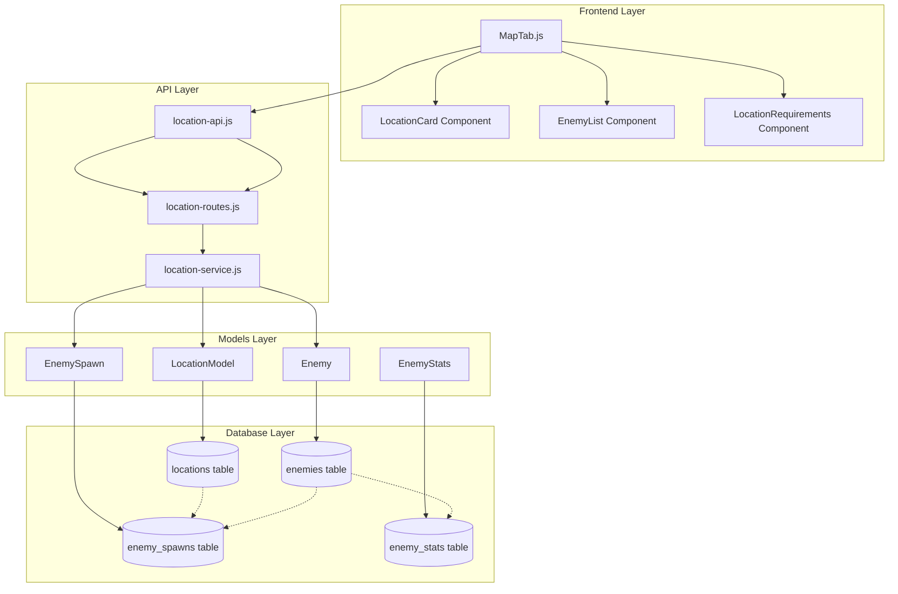

# Архитектура системы локаций

## Диаграмма архитектуры



## Поток данных

### 1. Загрузка локаций
```
MapTab.js → location-api.js → /api/locations → location-service.js → LocationModel → locations table
```

### 2. Получение врагов локации
```
MapTab.js → location-api.js → /api/locations/:id/enemies → location-service.js → EnemySpawn + Enemy → enemy_spawns + enemies tables
```

### 3. Путешествие между локациями
```
MapTab.js → проверка energyCost → обновление состояния игрока → смена локации
```

## Структура базы данных

### Таблица locations
```sql
CREATE TABLE locations (
    id VARCHAR(30) PRIMARY KEY,           -- Уникальный идентификатор
    name VARCHAR(100) NOT NULL,           -- Название локации
    description TEXT,                     -- Описание локации
    type VARCHAR(30) NOT NULL,            -- Тип (forest, swamp, cave, etc.)
    energy_cost INTEGER DEFAULT 0,       -- Стоимость путешествия
    background_image VARCHAR(200),       -- Путь к фоновому изображению
    enemies JSON,                        -- Список ID врагов (для быстрого доступа)
    coordinates JSON,                    -- Координаты на карте {x, y}
    effects JSON,                        -- Эффекты локации
    requirements JSON                    -- Требования для доступа
);
```

### Связи между таблицами
```
locations (1) ←→ (N) enemy_spawns ←→ (1) enemies
enemies (1) ←→ (1) enemy_stats
```

## API Endpoints

### Публичные маршруты
- `GET /api/locations` - Получить все локации
- `GET /api/locations/:id` - Получить локацию по ID
- `GET /api/locations/:id/enemies` - Получить врагов локации

### Административные маршруты (будущие)
- `POST /api/locations` - Создать новую локацию
- `PUT /api/locations/:id` - Обновить локацию
- `DELETE /api/locations/:id` - Удалить локацию

## Компоненты системы

### 1. LocationModel (Sequelize)
- Модель для работы с таблицей locations
- Связи с EnemySpawn
- Валидация данных

### 2. location-service.js
- Бизнес-логика работы с локациями
- Кэширование данных
- Форматирование для клиента

### 3. location-api.js
- HTTP клиент для фронтенда
- Кэширование запросов
- Обработка ошибок

### 4. MapTab.js
- Основной компонент карты
- Отображение локаций
- Логика путешествий

## Особенности реализации

### 1. Кэширование
- **Серверное**: В location-service.js для быстрого доступа
- **Клиентское**: В location-api.js для уменьшения запросов

### 2. Обработка ошибок
- Fallback к кэшированным данным
- Graceful degradation при недоступности API

### 3. Производительность
- JSON поля для гибкости структуры
- Индексы на часто используемые поля
- Ленивая загрузка связанных данных

### 4. Масштабируемость
- Модульная архитектура
- Легкое добавление новых локаций
- Расширяемая система эффектов

## Конфигурация локаций

### Типы локаций
- `forest` - Лес
- `swamp` - Болото
- `cave` - Пещера
- `desert` - Пустыня
- `mountain` - Горы
- `tower` - Башня

### Эффекты локаций
```json
{
  "type": "cultivation_bonus",
  "element": "fire",
  "modifier": 20
}
```

### Требования доступа
```json
{
  "cultivation": {
    "level": 10
  },
  "stats": {
    "strength": 50
  },
  "items": [
    {
      "id": "special_key",
      "quantity": 1
    }
  ]
}
```

## Система энергии

### Расчет стоимости
- Базовая стоимость из поля `energy_cost`
- Возможные модификаторы:
  - Уровень игрока
  - Особые предметы
  - Временные эффекты

### Проверка доступности
```javascript
const canTravel = player.energy >= location.energyCost;
```

## Система врагов в локациях

### Спавн врагов
- Вес появления (weight)
- Диапазон уровней (min_level, max_level)
- Условия появления (время суток, погода)

### Модификаторы
- Время суток влияет на шансы появления
- Погодные условия изменяют характеристики
- Сезонные эффекты

## Визуальная система

### Фоновые изображения
- Путь: `/assets/images/map/{id}.png`
- Размер: рекомендуется 1920x1080
- Формат: PNG с прозрачностью

### Эффекты времени суток
- Фильтры CSS для разного времени
- Анимации для особых событий
- Погодные оверлеи

## Миграция данных

### Переход от старой системы
1. Сохранение существующих локаций в новом формате
2. Миграция enemy_spawns
3. Обновление фронтенда
4. Тестирование совместимости

### Обратная совместимость
- Поддержка старого формата локаций
- Постепенный переход на новую систему
- Fallback механизмы

## Мониторинг и логирование

### Ключевые метрики
- Время загрузки локаций
- Частота путешествий
- Популярность локаций
- Ошибки API

### Логирование
- Запросы к API локаций
- Ошибки загрузки данных
- Действия игроков с локациями

## Безопасность

### Валидация данных
- Проверка ID локаций
- Валидация JSON полей
- Санитизация пользовательского ввода

### Авторизация
- Публичный доступ к чтению
- Административные права для изменений
- Проверка требований доступа к локациям

## Тестирование

### Unit тесты
- location-service.js функции
- Валидация моделей
- API endpoints

### Integration тесты
- Полный цикл загрузки локаций
- Взаимодействие с базой данных
- Frontend-backend интеграция

### E2E тесты
- Путешествие между локациями
- Отображение информации о локациях
- Проверка требований доступа

## Будущие улучшения

### Планируемые функции
1. **Динамические события** - случайные события в локациях
2. **Погодная система** - влияние погоды на локации
3. **Сезонные изменения** - изменение локаций по сезонам
4. **Групповые активности** - совместное исследование
5. **Строительство** - возможность изменять локации

### Оптимизации
1. **GraphQL API** - более гибкие запросы
2. **Real-time обновления** - WebSocket для живых изменений
3. **CDN для изображений** - быстрая загрузка фонов
4. **Предзагрузка** - кэширование соседних локаций

## Заключение

Новая система локаций обеспечивает:
- **Гибкость** - легкое добавление новых локаций
- **Производительность** - эффективное кэширование и загрузка
- **Масштабируемость** - модульная архитектура
- **Пользовательский опыт** - богатые визуальные эффекты и геймплей

Система готова к расширению и может адаптироваться под будущие требования игры.